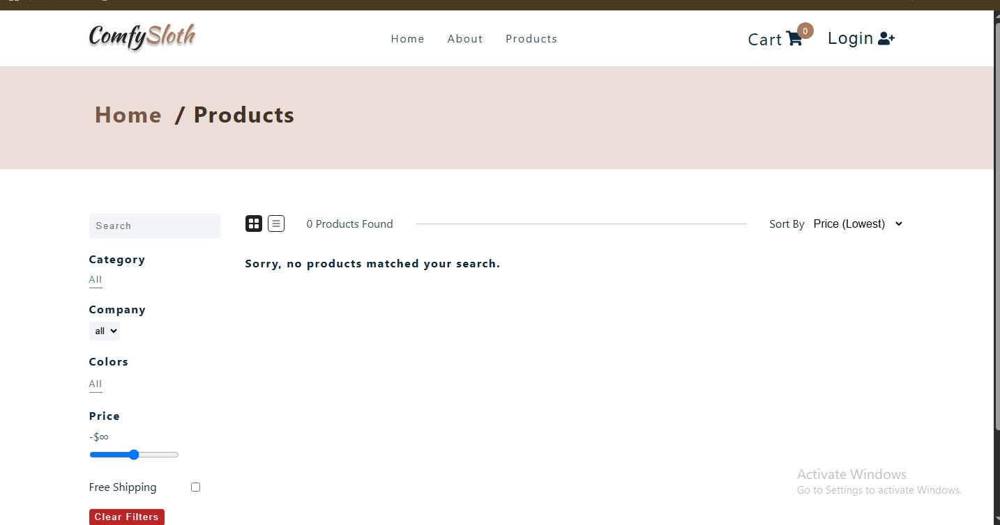
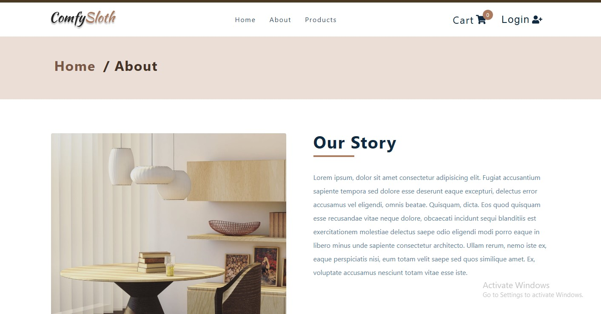

# Comfy Sloth — E-Commerce Platform

A modern, responsive e-commerce web application built for browsing, filtering, and buying furniture online. This project features a clean folder structure, global state management, and reliable third-party tools to handle secure user logins and payment checkouts.

🔗 **Live Deployment Link:** [https://react-project-two-amber.vercel.app/](https://react-project-two-amber.vercel.app/)

---

## 📷 App Previews

| Home Page | Products Page (Filters) |
|---|---|
|  |  |

| About Page | Cart View |
|---|---|
|  |  |

---

## 🚀 Features

* **Smart Filtering & Sorting:** Fast text search with filters for categories, companies, colors, price ranges, and shipping options.
* **Secure Login:** Easy user authentication and signup flows handled safely using Auth0.
* **Safe Checkout:** Complete shopping cart features integrated with the Stripe API to handle credit card payments securely.
* **Beautiful Layout:** Responsive web pages built using Styled Components to look perfect on mobile phones, tablets, and desktop monitors.
* **Protected Routes:** Built-in route guards that block access to the checkout pages unless a user is logged in.

---

## 🛠️ Tech Stack & Folder Setup

* **Frontend Framework:** React (v18)
* **Styling:** Styled Components (CSS-in-JS)
* **Routing:** React Router DOM (v6)
* **State Management:** React Context API + `useReducer` to separate core logic from UI layouts
* **Data Fetching:** Axios for external API connections
* **Authentication:** Auth0 SDK
* **Payments:** Stripe SDK & React Stripe JS

### Project Folder Structure
The source files are organized logically into clear directories:

```text
src/
├── assets/         # Static imagery and media assets
├── components/     # Reusable UI elements (Navbar, Cart, Sidebar, Filters, etc.)
├── context/        # Global state provider configs (Products, Cart, User contexts)
├── pages/          # Layout wrappers and view containers (Home, About, Checkout, etc.)
├── reducers/       # Pure functions managing structured state transitions
├── utils/          # Helper constants, data arrays, and API endpoint configs
├── actions.js      # Centralized global string action variables
├── App.js          # Core application route manager
└── main.jsx        # Project configuration entry point
